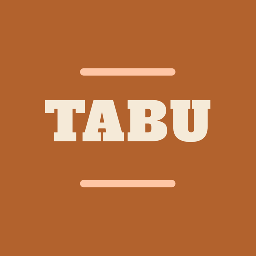
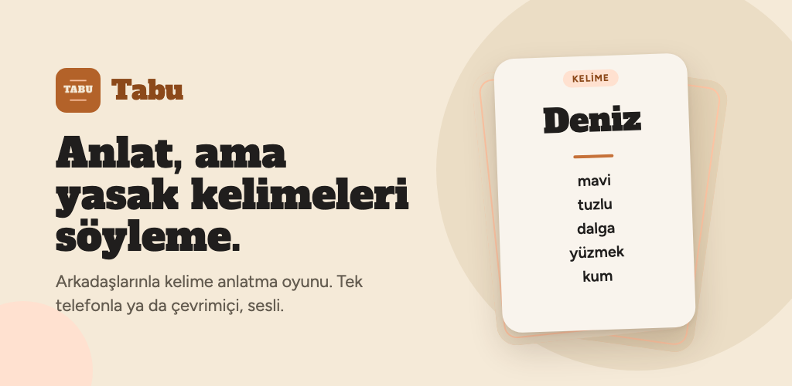
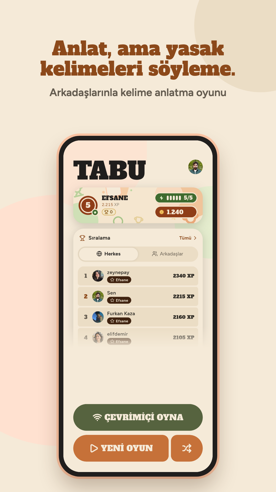
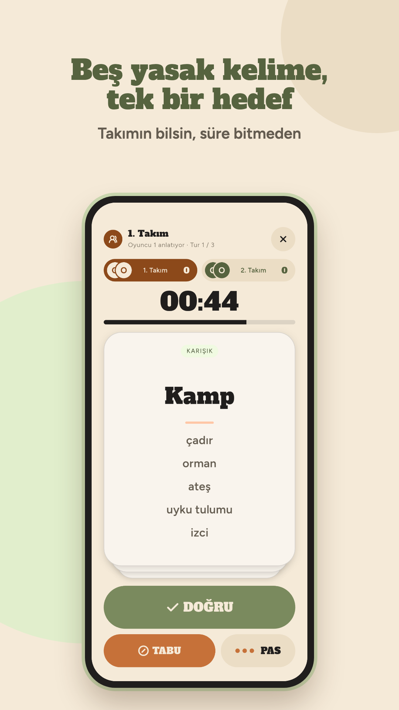
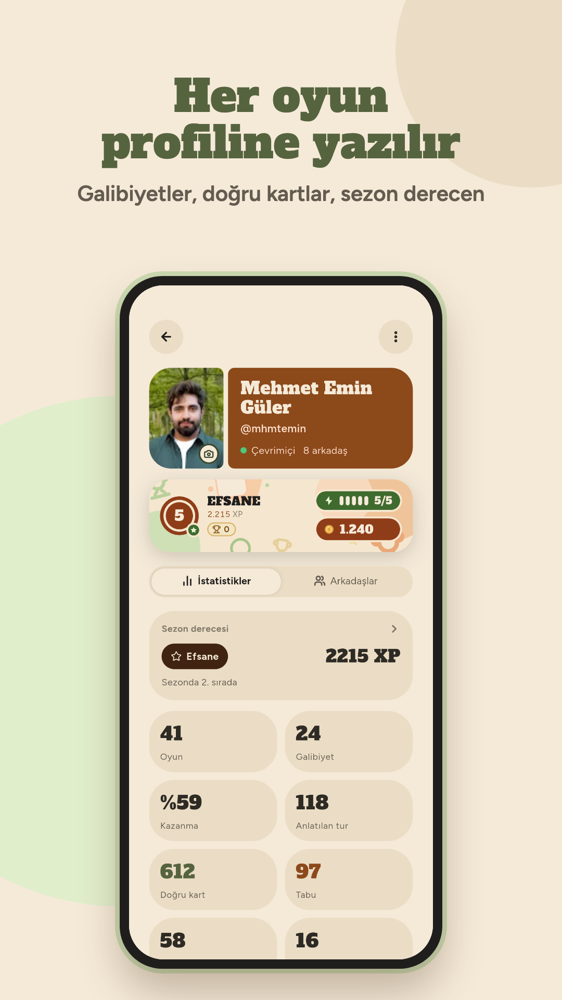
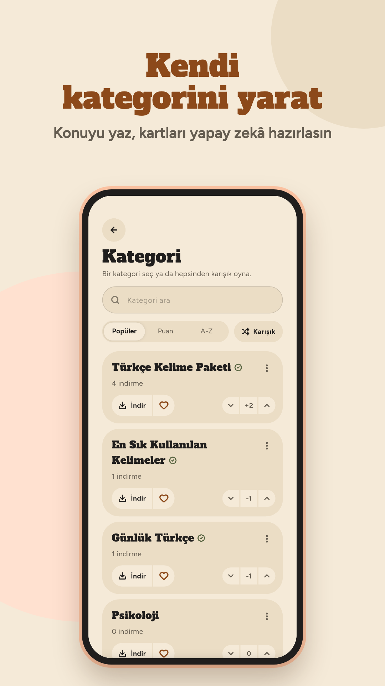
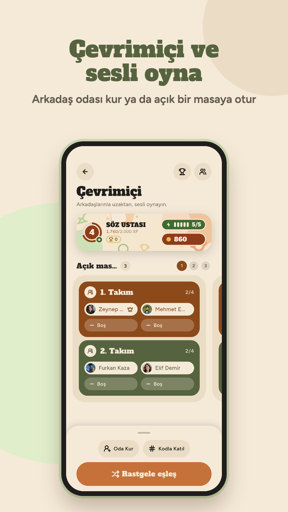
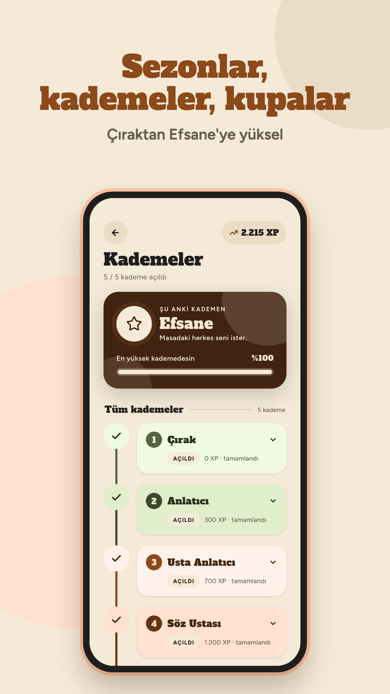

# Tabu

**Arkadaşlarınla aynı masada ya da sesli olarak çevrimiçi oynanan, Türkçe kelime anlatma oyunu.**

Flutter · Riverpod · Supabase · Agora · Firebase

<!-- Play Store'a çıkınca bu satırı aç:

-->

> 🔒 **Kaynak kod gizli.** Bu repo uygulamanın vitrini; kod ayrı ve private bir repoda duruyor.
> Projeyi incelemek istersen benimle iletişime geçebilirsin.

---

## Ekranlar

<table>
  <tr>
    <td></td>
    <td></td>
    <td></td>
  </tr>
  <tr>
    <td></td>
    <td></td>
    <td></td>
  </tr>
</table>

## Neler var?

### 🃏 Masada oyun
- İki takım, sırayla anlatma ve kaydırılan bir kart destesi: sağa **doğru**, sola **tabu**, yukarı **pas**.
- Tur süresi, puanlar ve oyunun bitişi (tur sayısı ya da hedef puan) ayarlanabiliyor.
- Hesap, internet ya da mikrofon gerektirmiyor. İndirilen kategoriler çevrimdışı da oynanıyor.

### 🌐 Sesli çevrimiçi oyun
- Arkadaşlarınla oda kodu ile, açık masalara katılarak ya da hızlı eşleşme ile oynanıyor.
- Herkes aynı sesli odada. Karşı takım anlatıcıyı dinliyor, yani hakem de o.
- Oyunun durumu sunucuda tutuluyor. Kartı yalnızca anlatıcı ve karşı takım görüyor, tahmin edenlerin telefonuna kelime hiç gelmiyor.
- Kopan oyuncu kaldığı yerden geri dönebiliyor.

### 📚 Paylaşılan kategori kütüphanesi
- Herkesin eriştiği bir kategori havuzu. Arama, sıralama, oylama, favoriler ve çevrimdışı indirme var.
- Aradığın kategori yoksa **yapay zekâ** ile yeni bir deste oluşturabiliyorsun.
- Hızlı oyun için elle seçilmiş, doğrulanmış Türkçe destelerden karışık bir deste geliyor.

### 🏆 Kademe, sezon ve ödüller
- Anlatıcı performansına göre XP kazanılıyor. Beş kademe var: Çırak → Anlatıcı → Usta Anlatıcı → Söz Ustası → Efsane.
- Küresel ve arkadaşlar arası sıralama tabloları var.
- Sezon sonunda ulaşılan kademeye göre bronz, gümüş ya da altın kupa veriliyor.
- Enerji ve altın ekonomisi var.

### 💬 Sosyal
- Arkadaş ekleme, profiller ve çevrimiçi durumu.
- Arkadaşlar arası mesajlaşma: oyun daveti ve maç sonucu kartları, "yazıyor…" göstergesi.
- Uygulama içi bildirim merkezi ve push bildirimleri.
- Engelleme, susturma ve şikâyet. Topluluk kuralları var.

## Teknik

| Katman | Kullanılanlar |
|---|---|
| **İstemci** | Flutter (Dart), Riverpod, go_router, Material 3 Expressive bileşenleri |
| **Backend** | Supabase: Postgres, Auth, Realtime, Storage, Edge Functions (Deno) |
| **Güvenlik** | Her tabloda Row Level Security, yazma işlemlerinin tamamı `SECURITY DEFINER` RPC'ler üzerinden |
| **Gerçek zamanlı** | Supabase Realtime kanalları ve sunucu tarafında saat yönetimi |
| **Ses** | Agora RTC |
| **Bildirim** | Firebase Cloud Messaging |
| **Yapay zekâ** | n8n iş akışı üzerinden çoklu LLM sağlayıcısı ile kart üretimi |
| **Giriş** | E-posta + tek kullanımlık kod, Google ile giriş. Giriş isteğe bağlı |

Uygulamada ayrıca şunlar var:
- Kendi tasarım sistemi: renk tokenları, uygulamanın kendi yazı tipleri ve yay tabanlı animasyonlar.
- Türkçe ve İngilizce arayüz.
- Widget ve birim testleri.

---

© 2026 Mehmet Emin Güler. Tüm hakları saklıdır.

